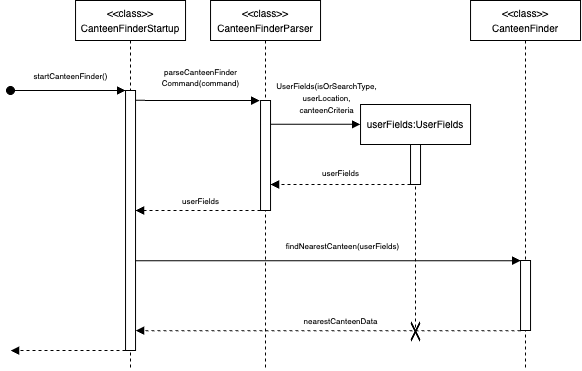
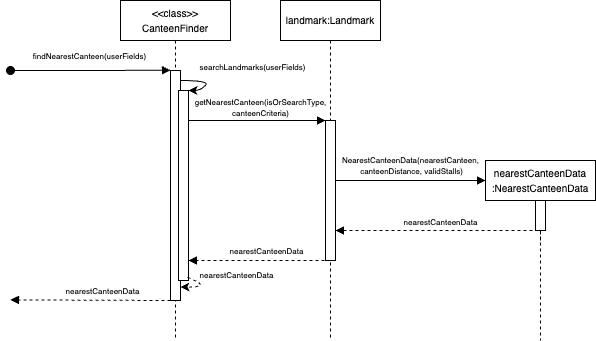
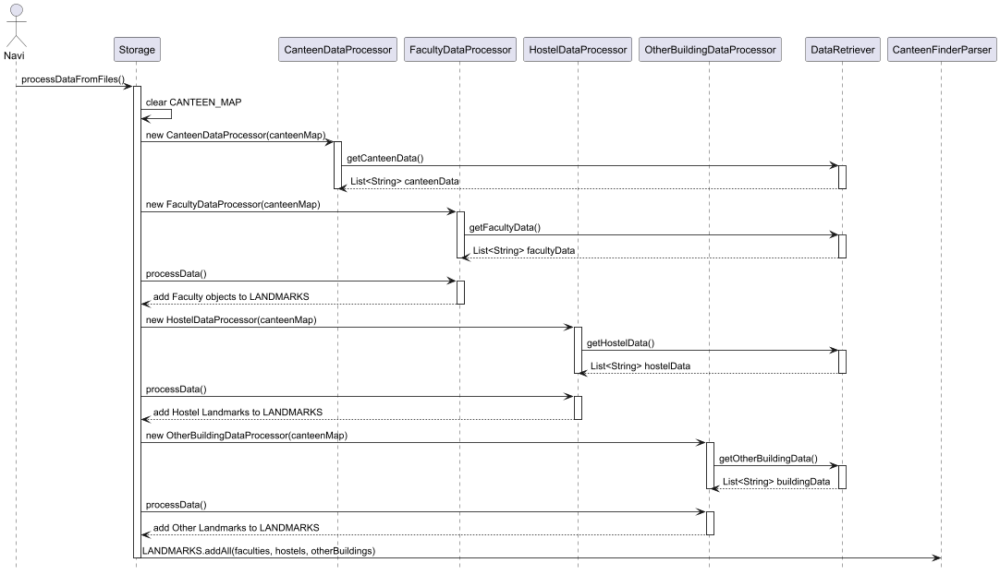
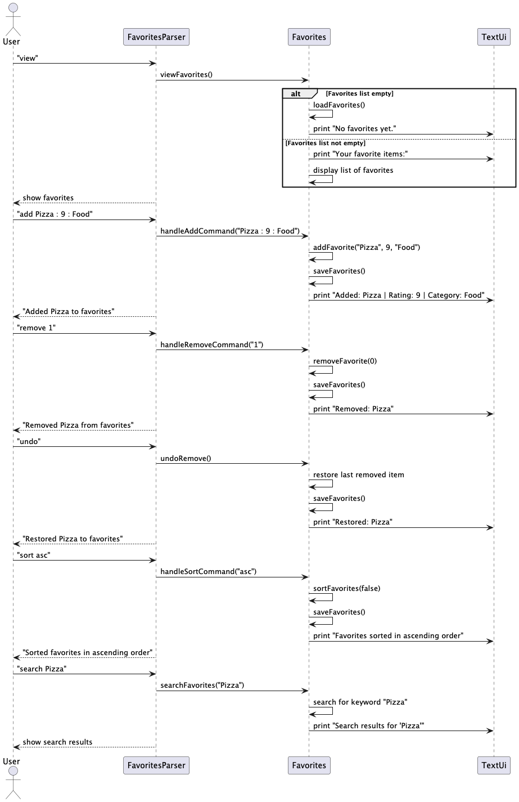

# Developer Guide

## Acknowledgements
___
Some UML diagrams within the Developer Guide have been created on [Draw.io](https://draw.io/)

## Design & implementation
___
## Canteen Feature
The Canteen feature provides 2 sub-features: Canteen Finder and Canteen Lookup.

This functionality is controlled by the `CanteenMain` class where `startCanteen()`, a class level method,
would immediately enter an infinite loop which can only be exited when the user enters the `quit` command.
In this loop, users can enter either `finder` or `lookup` to access the 2 sub-features.

If the user enters `feature`, `startCanteenFinder()`, a class level method of `CanteenFinder` would be called
to start the Canteen Finder sub-feature.

If the user enters `lookup` instead, `startCanteenLookup()`, a class level method of `CanteenLookup` would be
called to start the Canteen Lookup sub-feature.

The following UML Sequence diagram shows the Canteen feature. The starting arrow indicates `Navi` calling `startCanteen()`
of `CanteenMain` to begin the Canteen feature.

___
### Canteen Finder Feature 
The Canteen Finder sub-feature allows the user to find the nearest canteen relative to where the user is in NUS Kent 
Ridge Campus. 

This functionality is controlled by the `CanteenFinderStartup` class where `startCanteenFinder()` would call 
`parseCanteenFinderCommand()`, a class level method, of the `CanteenFinderParser` class. 

`parseCanteenFinderCommand()` would then parse the command by the user and store them in an instance of the `UserFields` record
which contains the attributes `isOrSearchType`, `userLocation` and `canteenCriteria`.
This instance is then return back to `CanteenFinderStartup` in which its elements will be passed on to `CanteenFinder` class
through `findNearestCanteen()` to begin the search.

At the end, an instance of the record `NearestCanteenData` is returned to `CanteenFinderStartup` in which its contents would
be printed to the user.

The following UML Sequence diagram shows the overall and parsing aspect of the Canteen Finder feature. 
The starting arrow indicates `CanteenMain` calling `startCanteenFinder()` of `CanteenFinderStartup` to begin the Canteen Finder feature.

The searching functionality of the Canteen Finder feature is controlled by the `Canteen Finder` class. Where
`findNearestCanteen()` would be called by `CanteenFinderStartup` as mentioned above.

`findNearestCanteen()` would then call a helper method `searchLandmarks()` to search the collection of landmark objects in `CanteenFinder`
to find the landmark that corresponds to `userLocation`. 
Once the landmark is found, `findNearestCanteen()` will then call `getNearestCanteen()` of landmark to 
get the nearest canteen that fits the search type and canteen criteria stated by the user in `isOrSearchType`
and `canteenCriteria`. 

Once retrieved, `getNearestCanteen()` would then retrieve the distance of the canteen to the landmark where the user is located
stored in a collection of canteen distances in landmark.

`getNearestCanteen()` would then return the object `nearestCanteenData` which is an instance of the Record `NearestCanteenData` which stores 
the three attributes: 
`nearestCanteen`, `landmarkToCanteenDist` and `validStalls`. 

`nearestCanteenData` is then return back to `CanteenFinder` which is then returned to 
`CanteenFinderStartup`.

The following UML Sequence diagram shows the searching functionality of the Canteen Finder feature. 
The starting arrow indicates `CanteenFinderStartup` calling `findNearestCanteen()` of `CanteenFinder` to begin the search.

___
### Canteen Lookup Feature
The Canteen Lookup sub-feature allows the user to look up the different stalls and its characteristics of the specified
canteen.

This functionality is controlled by the `CanteenLookup` class where `startCanteenLookup()` would call 
`searchCanteen(canteenName)`, a class level method, of the CanteenSearch class.

`searchCanteen()` would then...
___
### Storage
The Storage class is responsible for managing the persistent storage of canteen, faculty, hostel, and other building data.
The data loading process is initiated by calling processDataFromFiles(), which sequentially processes different
categories of data from hardcoded strings into appropriate data structures.

The method follows these key steps:

1.  It first clears CANTEEN_MAP, a static Map<String, Canteen>, to ensure that previously loaded data does not persist.
2.  It then sequentially calls:
    * `processCanteenFromFile()` using `CanteenDataProcessor` to retrieve and parse canteen data via `DataRetriever`, creating `Canteen` objects and storing them in CANTEEN_MAP.
    * `processFacultyFromFile()` using `FacultyDataProcessor` to retrieve and process faculty data via `DataRetriever`, creating `Faculty` objects and updating CanteenFinderParser.LANDMARKS.
    * `processHostelFromFile()` using `HostelDataProcessor`  to retrieve and process hostel data via `DataRetriever`, creating `Landmark` objects for hostels.
    * `processOtherBuildingFromFile()` using `OtherBuildingDataProcessor` to retrieve and process other building data via `DataRetriever`, creating `Landmark` objects accordingly.

Once all data is processed, `CanteenFinderParser.LANDMARKS` is populated with the loaded objects. This enables the
`CanteenFinder` feature to determine the nearest canteens relative to various landmarks.

If a canteen is not found in the `canteenMap` during the processing of faculty, hostel, or other building data, a warning message is printed to `System.err`.

The following UML Sequence Diagram illustrates the interaction between different components during data loading.
It shows Navi, the main program, invoking `processDataFromFiles()` in the `Storage` class, which in turn delegates the
processing of specific data types to `CanteenDataProcessor`, `FacultyDataProcessor`, `HostelDataProcessor`, and
`OtherBuildingDataProcessor`. These processors create appropriate objects (`Canteen`, `Faculty`, `Landmark`) and establish
relationships such as nearest canteens and distances between entities.

___
### Favorites feature
This feature allows users to manage a list of favorite items, supporting adding, removing, viewing, sorting, and 
searching. It also includes an undo function for deletions.

### Core Components
Favorites class: Manages favorite items and undo functionality.

### Data structures:
favoriteItems (ArrayList) - Stores favorite entries as formatted strings.
undoStack (Stack) - Tracks deleted items for undo operations.

### Key Operations
`addFavorite(description, rating, category)`: Adds a new favorite in the format "Description | Rating: X | Category: Y".

`removeFavorite(index)`: Removes an item by index, storing it in undoStack for possible recovery.

`undoRemove()`: Restores the most recently deleted favorite if available.

`viewFavorites()`: Displays all favorites in a numbered list or a message if empty.

`sortFavorites(boolean ascending)`: Sorts favorites by rating using a custom comparator.

`searchFavorites(keyword)`: Finds and displays entries matching the keyword (case-insensitive).

### System Behavior
Operates entirely in-memory using formatted strings.
Undo only supports single-level restoration of deletions.
Immediate feedback is provided through console messages.

### Design Considerations
ArrayList<String> is used for favoriteItems because:
* Fast indexed access (O(1))
* Efficient for sorting and iterating

Stack<String> is used for undoStack because:
* LIFO (Last-In-First-Out) is ideal for undo operations.
* Constant time (O(1)) push and pop operations.

Persistent Storage ensures data is not lost between sessions by saving the favorites list to a file.

### Future Enhancements
Potential improvements include Expanded search/filter options, multi-step undo/redo, and additional 
sorting criteria.

___
## Budget feature
This feature allows users to track their daily, weekly and monthly expenses on food as well as the weekly budget.
* Budget class: Handles core budget logic, including managing expenses, budget resets, and file persistence.
* BudgetParser class: Handles user interaction and command parsing
* Data storage: Budget data is stored persistently in a JSON-like format.

#### Core Logic
The Budget class maintains several data:
* `weeklyBudget`: Current available budget
* `dailyExpenses`, `weeklyExpenses`, `monthlyExpenses`: Tracked expenses
* `lastUpdatedDate`: Ensures proper period resets

Key operations include:
1. `addWeeklyBudget()`: Adds to current weekly budget
2. `deductExpense()`: Deducts the specified amount from the weekly budget and updates daily, weekly, and monthly 
expenses.
3. `viewExpenses()`: Displays the current state of the weekly budget, daily expenses, weekly expenses, and monthly 
expenses.
4. `resetWeeklyBudget(boolean carryOver)`: Resets the weekly budget, with an option to carry over any remaining budget 
from the previous week.
5. `resetIfNeeded()`: Periodic resets if needed
* *Daily Reset*: Resets daily expenses at midnight.
* *Weekly Reset*: Resets weekly expenses every Sunday.
* *Monthly Reset*: Resets total monthly expenses at the start of a new month.

### Sequence of operations
1. Upon launching the application, the Navi.main() method initializes the system and prompts the user for input.
If the user enters the command budget, the `BudgetParser.start()` method is invoked.
2. If it is Monday, Budget asks the user if they want to carry over weekly budget from previous week and
`resetWeeklyBudget(boolean carryOver)` is invoked. If it is midnight,monday or the date is 1st, `resetIfNeeded()` is 
invoked to do periodic resets to the expenses.
3. The BudgetParser class displays a prompt asking the user to enter a command: `add X, deduct X, view, reset, or exit.`
4. The user can add a specified amount (X) to their weekly budget by entering `add X`. The `Budget.addWeeklyBudget()`
method is invoked, which updates the weekly budget and saves the data.
5. The user can deduct an amount (X) from the weekly budget by entering `deduct X`. The `Budget.deductExpense()` 
method is called to handle this operation, and the daily, weekly and monthly expenses are updated accordingly. 
The `Budget.addWeeklyBudget()` method is invoked, which updates the weekly budget and saves the data.
6. The user can view the current budget and expenses for the day, week, and month by entering `view`. 
The `Budget.viewExpenses()` method displays this information.
7. The user can exit the budget feature by entering `exit`, which ends the BudgetParser session.

The following sequence diagram illustrates the workflow when a user `add 100` to their budget and `view`:

## Product scope
___
### Target user profile

NUS students, faculty or staff who need guidance to find or lookup canteens, manage budgets, and track their favorite food stalls 
in the NUS Kent Ridge Campus.

### Value proposition

Navi simplifies campus dining at NUS by solving key challenges: finding nearby canteens, managing food expenses,
and tracking favorite meals. It helps users locate canteens based on their location and dietary preferences, 
like Halal Certified or Vegetarian, while a budget tracker ensures they stay within spending limits. 
A favorites list that lets users save, rate, and comment on stalls, making it easy to revisit great meals. 
Hence, Navi saves time as well as promotes exploration all in one intuitive app.

## User Stories
___
| Version | As a ...                      | I want to ...                                                               | So that I can ...                                                               |
|---------|-------------------------------|-----------------------------------------------------------------------------|---------------------------------------------------------------------------------|
| v1.0    | new user                      | see usage instructions                                                      | refer to them when I forget how to use the application                          |
| v1.0    | user with dietary restriction | find a canteen that matches my dietary restrictions                         | conveniently find canteens to dine at that falls within my dietary restrictions |
| v1.0    | hungry user                   | know which canteen is nearest to me                                         | go and eat as soon as possible                                                  |
| v1.0    | hot user                      | know which canteen has air conditioning                                     | go and eat in a cooling environment                                             |
| v1.0    | user                          | know how far the nearest canteen is away from me                            | roughly know how long it'll take to get there                                   |
| v1.0    | student                       | set a weekly budget                                                         | manage my spending on meals effectively                                         |
| v1.0    | budget-conscious user         | track my daily/weekly food expenses                                         | stay within my weekly budget                                                    |
| v1.0    | organised user                | see my remaining weekly budget                                              | make informed decisions about where/what to eat                                 |
| v2.0    | user with dietary restriction | know which exact stalls in the canteen that matches my dietary restrictions | conveniently find stalls to buy from that falls within my dietary restrictions  |
| v2.0    | lazy user                     | have command shortcuts                                                      | save time typing and manoeuvre around the app quickly                           |
| v2.0    | adventurous user              | check what stalls does other canteens have aside from the one nearest to me | try new food and explore new cuisines                                           |
| v2.0    | reflective user               | view my monthly spendings                                                   | understand my long-term eating habits and adjust accordingly                    |
| v2.0    | user with habit of saving     | carry over unused budget to the next week                                   | have flexibility in my spending across weeks                                    |

## Non-Functional Requirements
___
1. The app should work on any mainstream OS as long as it has java17 or above installed.

## Glossary
___
* `command 1` -> `command 2`
    * referring to typing `command 1` and pressing enter then `command 2` and pressing enter

## Instructions for manual testing
___
### Launching Navi
* Download the jar file and copy it to an empty folder.
* Navigate to the jar file via a Terminal window.
* Start the jar file with the command `java -jar Navi.jar`
* Users should see a greeting message, prompting user to enter their name.

### Test cases
#### <u> Navi main menu </u>
* Test case: `canteen`
  * Expected: Navi enters the canteen feature
* Test case: `favorites`
  * Expected: Navi enters the favorites feature
* Test case: `budget`
  * Expected: Navi enters the budget feature
* Test case: `bye`
  * Expected: Exits Navi, program ends
* Test case: `CS2113` or ` `
  * Expected: Nothing happens and error message is shown with details on valid inputs
#### <u> 1. Canteen menu</u>
Prerequisites: Entered `canteen`
* Test case: `finder`
  * Expected: Navi enters canteen finder feature
* Test case: `lookup`
  * Expected: Navi enters canteen lookup feature
* Test case: `exit`
  * Expected: Navi exits Canteen feature
#### <u> 1.1 Canteen Finder </u>
Prerequisites: Entered `canteen` -> `finder`
* Test case: `Halal Certified` -> `CDE`
  * Expected: Navi lists all the halal certified stalls in Techno Edge
* Test case: `NIL` -> `SOC`
  * Expected: Navi lists all the stalls in Terrace
* Test case: `exit`
  * Expected: Navi exits Canteen Finder feature
* Test case: `CS2113` or ` `
    * Expected: Nothing happens and error message is shown with details on valid inputs
#### <u> 1.2 Canteen Lookup </u>
Prerequisites: Entered `canteen` -> `lookup`
* Test case: `Techno Edge`
  * Expected: Navi lists all the stalls in Techno Edge
* Test case: `exit`
  * Expected: Navi exits Canteen Lookup feature
* Test case: `CS2113` or ` `
    * Expected: Nothing happens and error message is shown with details on valid inputs
#### <u> 2. Budget tracker </u>
Prerequisites: Entered `budget`
* Test case: `add 100`
    * Expected: Navi adds $100 to weekly budget and shows remaining weekly budget.
* Test case: `deduct 20`
    * Expected: Navi deducts $20 from weekly budget and adds it to daily expenses, weekly expenses and monthly expenses. 
Navi shows remaining weekly budget.
* Test case: `view`
    * Expected: Navi shows remaining weekly budget, total spent today, total spent this week and total spent this month.
* Test case: `exit`
    * Expected: Navi exits from budget tracker feature and returns to main menu.
* Test case: `cs2113`
    * Expected: Navi shows an error message with details on valid inputs
* Test case: `add abc` or `add -50`
    * Expected: Navi shows a message to enter a positive number or a valid number

To test automatic reset of daily/weekly/monthly expenses and manual reset of weekly budget:
1. Add budget and deduct some expenses as per normal
2. Quit Navi jar file and change the date on your computer settings
   1. To test all 4 resets at the same time, change the date to 2 May 2025 
   2. To test daily expenses reset only, change the date to 12 April.
   3. To test reset of weekly expenses and weekly budget (where you will be prompted with the question of `Do you want to carry over last week's remaining budget? (yes/no)`),
change the date to 14 April 
   4. To test monthly expenses reset only, change the date to 2 May
3. Enter Navi jar file again and enter budget feature (`budget`)
4. Check remaining budget and expenses by entering `view`
#### <u> 3. Favorites manager </u>

