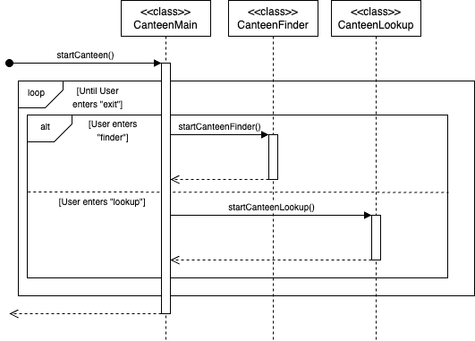

# Developer Guide

## Acknowledgements

{list here sources of all reused/adapted ideas, code, documentation, and third-party libraries -- include links to the original source as well}

## Design & implementation
___
## Canteen
The Canteen feature provides 2 sub-features: Canteen Finder and Canteen Lookup.

This functionality is controlled by the `Canteen` class where `startCanteen()`, a class level method,
would immediately enter an infinite loop which can only be exited when the user enters the `quit` command.
In this loop, users can enter either `finder` or `lookup` to access the 2 sub-features.

If the user enters `feature`, `startCanteenFinder()`, a class level method of `CanteenFinder` would be called
to start the Canteen Finder sub-feature.

If the user enters `lookup` instead, `startCanteenLookup()`, a class level method of `CanteenLookup` would be
called to start the Canteen Lookup sub-feature.

The following UML Sequence diagram shows the Canteen feature. The starting arrow indicates `Navi` calling `startCanteen()`
of `Canteen` to begin the Canteen feature.

___
### Canteen Finder Feature 
The Canteen Finder sub-feature allows the user to find the nearest canteen relative to where the user is in NUS Kent Ridge Campus. 

This functionality is controlled by the `CanteenFinder` class where `startCanteenFinder()` would call 
`findNearestCanteen(userLocation, canteenCriteria)`, a class level method, of the `CanteenFinderParser` class. 

`findNearestCanteen()` would then call a helper method to search the collection of landmark objects to find the landmark that corresponds to `userLocation`. 
Once the landmark is found, `findNearestCanteen()` will then call `getNearestCanteen(canteenCriteria)` of landmark to get the nearest canteen that fits the 
criteria stated by the user listed in `canteenCriteria`. 

Once retrieved, `getNearestCanteen()` would also call a helper method 
`getCanteenDistance(nearestCanteen)` to retrieve the distance of the canteen to the landmark where the user is located.

`getNearestCanteen()` would then return the object `nearestCanteenData` of the Record `NearestCanteenData` which stores the three attributes: 
`nearestCanteen`, `landmarkToCanteenDist` and `validStalls`. 

`nearestCanteenData` is then return back to `CanteenFinder` which will print
the attributes to the user.

The following UML Sequence diagram shows the Canteen Finder feature. The starting arrow indicates `Canteen` calling `startCanteenFinder()` 
of `CanteenFinder` to begin the Canteen Finder sub-feature.

### Canteen Lookup Feature
The Canteen Lookup sub-feature allows the user to look up the different stalls and its characteristics of the specified canteen.

This functionality is controlled by the `CanteenLookup` class where `startCanteenLookup` would call `searchCanteen(canteenName)`,
a class level method, of the CanteenSearch class.

`searchCanteen()` would then...

### Storage feature
The Storage class is responsible for managing the persistent storage of canteen, faculty, hostel, and other building data.
The data loading process is initiated by calling processDataFromFiles(), which sequentially processes different
categories of data from files into appropriate data structures.

The method follows these key steps:
It first clears CANTEEN_MAP, a static Map<String, Canteen>, to ensure that previously loaded data does not persist.
It then sequentially calls:
processCanteenFromFile() to read and parse canteen data, creating Canteen objects and storing them in CANTEEN_MAP.
processFacultyFromFile() to process faculty data, creating Faculty objects and updating CanteenFinderParser.LANDMARKS.
processHostelFromFile() to handle hostel data, creating Landmark objects for hostels.
processOtherBuildingFromFile() to process other buildings, creating Landmark objects accordingly.

Once all data is processed, CanteenFinderParser.LANDMARKS is populated with the loaded objects. This enables the
CanteenFinder feature to determine the nearest canteens relative to various landmarks.

In case of missing or inaccessible files, processDataFromFiles() throws a FileNotFoundException and logs errors to
System.err.

The following UML Sequence Diagram illustrates the interaction between different components during data loading.
It shows Navi, the main program, invoking processDataFromFiles() in the Storage class, which in turn delegates the
processing of specific data types to CanteenDataProcessor, FacultyDataProcessor, HostelDataProcessor, and
OtherBuildingDataProcessor. These processors create appropriate objects (Canteen, Faculty, Landmark) and establish
relationships such as nearest canteens and distances between entities.

___
### Favorites feature 
Favorites Feature
The favorites feature provides users with a system to manage their preferred items through a centralized `Favorites` 
class. This class maintains two core data structures - an ArrayList called `favoriteItems` that stores all favorite 
entries in a formatted string representation, and a Stack called `undoStack` that tracks recently deleted items to 
support undo functionality.

When adding new favorites, the `addFavorite` method accepts three parameters - description, rating, and category. 
These components are combined into a standardized string format "Description | Rating: X | Category: Y" which 
gets added to the `favoriteItems` collection. The method provides immediate visual feedback through console output to
confirm the successful addition.

For removal operations, the `removeFavorite` method first validates the provided index against the current list 
bounds. If valid, it extracts the target item from `favoriteItems`, pushes it onto the undoStack for potential recovery, 
and displays a removal confirmation message. Invalid indices trigger an appropriate warning message.

The `undoRemove` functionality checks the undoStack for available operations. When items exist in the stack, it pops the 
most recent deletion and restores it to `favoriteItems` while providing visual confirmation. If the stack is empty, it 
informs the user that no undo operations are available.

The `viewFavorites` method handles display operations by first checking if `favoriteItems` is empty. When populated, it 
presents all items in a clean numbered list format, while empty states trigger a "No favorites yet" message. This 
ensures users always receive appropriate feedback.

Advanced operations include the `sortFavorites` method which implements rating-based sorting through a custom 
Comparator. The method parses the rating values from the stored strings, performs the sort in either ascending
or descending order based on the boolean parameter, and confirms completion to the user. The `searchFavorites` method 
provides case-insensitive keyword matching across all favorite entries, displaying matches or notifying the user 
when no results are found.

The system architecture emphasizes simplicity through in-memory storage using formatted strings, though this 
requires parsing operations for certain features. The undo functionality currently supports single-level undo
for deletions only. All operations provide immediate visual feedback through the console interface. Future extensions
could introduce persistent storage, enhanced search capabilities, additional sorting criteria, and more comprehensive 
undo/redo functionality while maintaining the current straightforward user interaction model.

The following UML Sequence diagram illustrates the core favorite management workflow. The starting arrow indicates the 
main program initializing the Favorites feature through its constructor.

## Product scope
### Target user profile

NUS students who need guidance to find or lookup canteens, manage budgets, and track their favorite food stalls 
in the NUS Kent Ridge Campus.

### Value proposition

Navi simplifies campus dining at NUS by solving key challenges: finding nearby canteens, managing food expenses,
and tracking favorite meals. It helps users locate canteens based on their location and dietary preferences, 
like Halal Certified or Vegetarian, while a budget tracker ensures they stay within spending limits. 
A favorites list that lets users save, rate, and comment on stalls, making it easy to revisit great meals. 
Hence, Navi saves time as well as promotes exploration all in one intuitive app.

## User Stories

| Version | As a ...                      | I want to ...                                                               | So that I can ...                                                               |
|---------|-------------------------------|-----------------------------------------------------------------------------|---------------------------------------------------------------------------------|
| v1.0    | new user                      | see usage instructions                                                      | refer to them when I forget how to use the application                          |
| v1.0    | user with dietary restriction | find a canteen that matches my dietary restrictions                         | conveniently find canteens to dine at that falls within my dietary restrictions |
| v1.0    | hungry user                   | know which canteen is nearest to me                                         | go and eat as soon as possible                                                  |
| v1.0    | hot user                      | know which canteen has air conditioning                                     | go and eat in a cooling environment                                             |
| v1.0    | user                          | know how far the nearest canteen is away from me                            | roughly know how long it'll take to get there                                   |
| v2.0    | user with dietary restriction | know which exact stalls in the canteen that matches my dietary restrictions | conveniently find stalls to buy from that falls within my dietary restrictions  |
| v2.0    | lazy user                     | have command shortcuts                                                      | save time typing and manoeuvre around the app quickly                           |
| v2.0    | adventurous user              | check what stalls does other canteens have aside from the one nearest to me | try new food and explore new cuisines                                           |

## Non-Functional Requirements

1. The app should work on any mainstream OS as long as it has java17 or above installed.

## Glossary

* *glossary item* - Definition

## Instructions for manual testing

{Give instructions on how to do a manual product testing e.g., how to load sample data to be used for testing}

## Budget feature
This feature allows users to track their daily, weekly and monthly expenses on food as well as the weekly budget.
* Budget class: Handles core budget logic, including managing expenses, budget resets, and file persistence.
* BudgetParser class: Handles user interaction and command parsing
* Data storage: Data Storage - Budget data is stored persistently in a JSON-like format.

#### Core Logic
The Budget class maintains several key pieces of data:
* weeklyBudget: Current available budget
* dailyExpenses, weeklyExpenses, monthlyExpenses: Tracked expenses
* lastUpdatedDate: Ensures proper period resets

Key operations include:

1. addWeeklyBudget(): Adds to current weekly budget
2. deductExpense(): Records and deducts expenses
3. viewExpenses():  Displays the remaining weekly budget and total monthly spending.
4. resetIfNeeded(): Checks and performs periodic resets
* *Daily Reset*: Resets daily expenses at midnight.
* *Weekly Reset*: Resets weekly expenses every Monday. 
* *Monthly Reset*: Resets total monthly expenses at the start of a new month.
